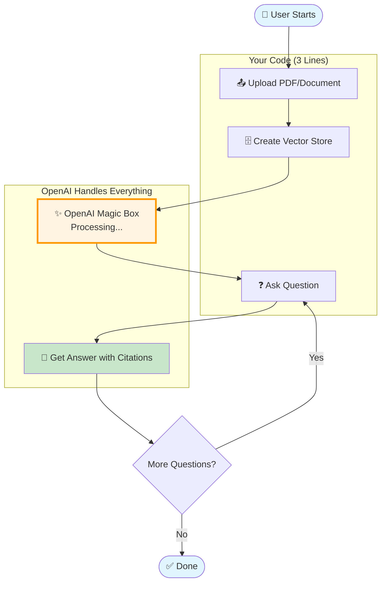
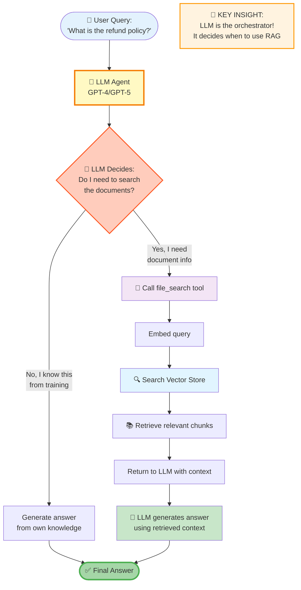
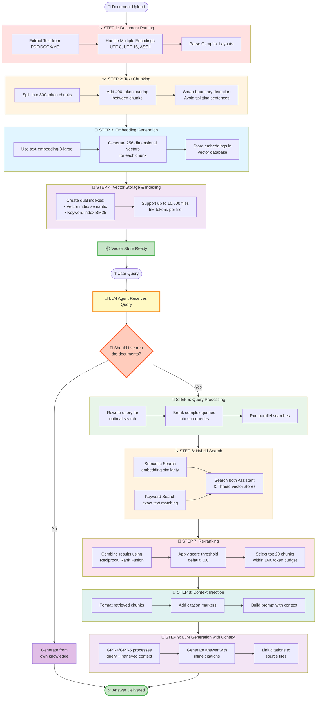
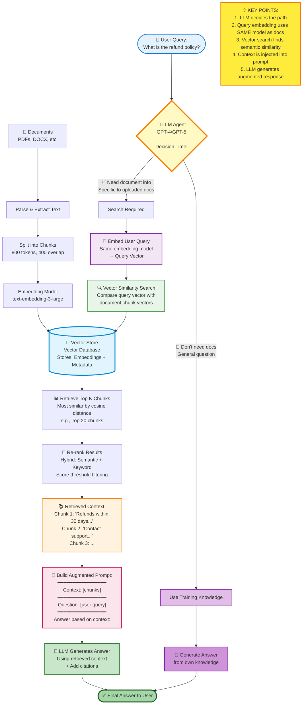
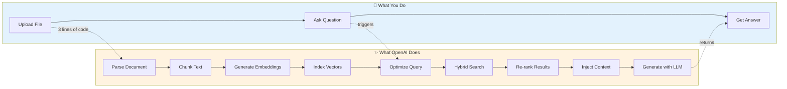
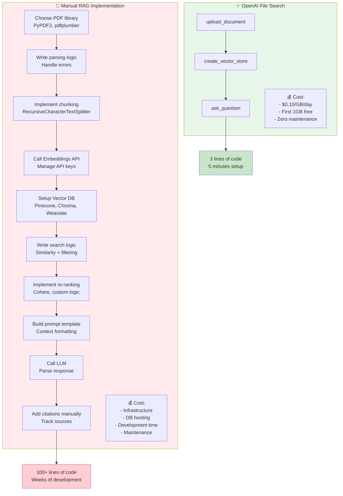
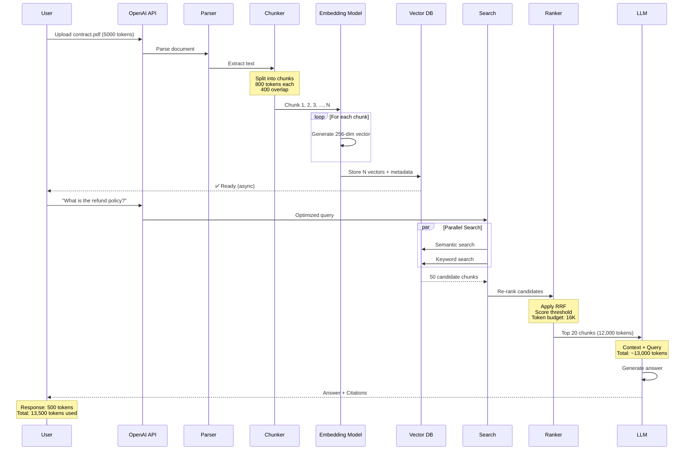
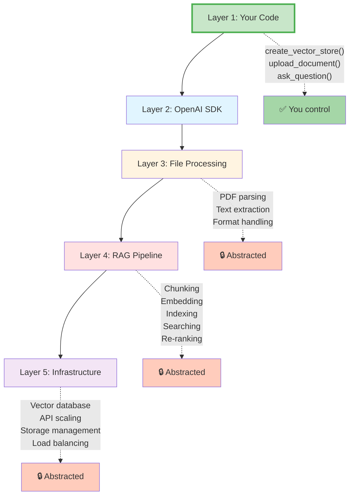
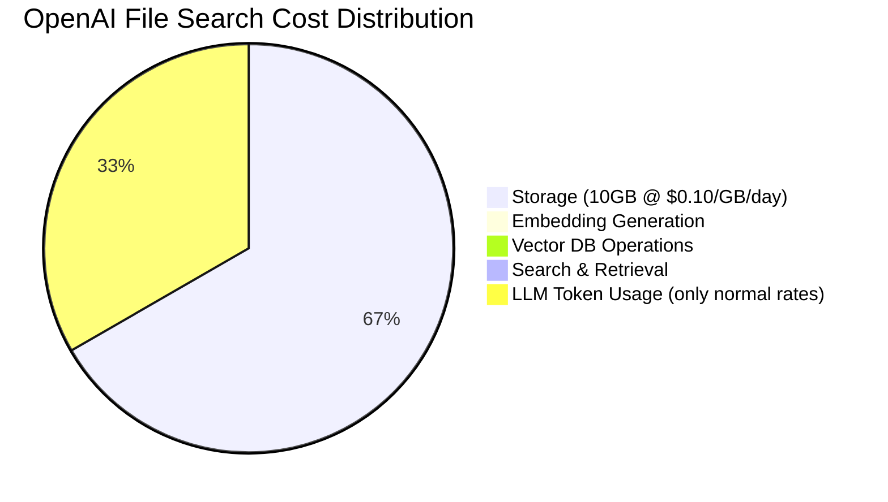
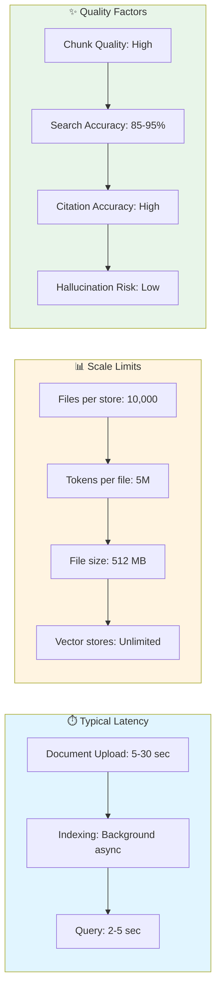

# OpenAI File Search - Visual Explanation

## 🎯 KEY ARCHITECTURAL INSIGHT

**OpenAI File Search is AGENTIC, not a simple retrieval pipeline!**

```
Traditional RAG:  User Query → Always search vector DB → Return chunks → LLM generates

OpenAI File Search:  User Query → LLM Agent decides → [Use file_search tool? Yes/No] 
                                                        ↓                    ↓
                                            Search vector DB          Use own knowledge
                                                        ↓                    ↓
                                                  Generate answer with citations
```

**From OpenAI Docs:**
> "Once the `file_search` tool is enabled, **the model decides when to retrieve content** based on user messages."

This means:
- ✅ The LLM is the orchestrator/agent
- ✅ Query goes to LLM **first**, not directly to vector store
- ✅ LLM intelligently decides whether to use the file_search tool
- ✅ Can combine document knowledge + training knowledge
- ✅ More efficient - doesn't retrieve unnecessarily

---

## Diagram 1: High-Level User Experience (What You See)



---

## Diagram 1B: The Agentic Flow (How It Really Works)



---

## Diagram 1C: Agentic Decision Examples

```mermaid
graph TB
    subgraph Example1["📝 Example 1: Document-Specific Question"]
        Q1["User: 'What is the refund policy<br/>in the contract?'"]
        LLM1[🤖 LLM thinks:<br/>'This needs document info']
        A1[✅ Uses file_search tool]
        R1[Returns: 'Refunds within 30 days [0]']
        Q1 --> LLM1 --> A1 --> R1
    end
    
    subgraph Example2["🌍 Example 2: General Knowledge Question"]
        Q2["User: 'What is the capital<br/>of France?'"]
        LLM2[🤖 LLM thinks:<br/>'I know this from training']
        A2[❌ Skips file_search tool]
        R2[Returns: 'Paris']
        Q2 --> LLM2 --> A2 --> R2
    end
    
    subgraph Example3["🔀 Example 3: Hybrid Question"]
        Q3["User: 'How does our refund policy<br/>compare to industry standards?'"]
        LLM3[🤖 LLM thinks:<br/>'Need both document + knowledge']
        A3[✅ Uses file_search for company policy<br/>+ Uses own knowledge for industry info]
        R3[Returns: 'Your policy: 30 days [0]<br/>Industry average: 14-30 days']
        Q3 --> LLM3 --> A3 --> R3
    end
    
    style Q1 fill:#e3f2fd
    style Q2 fill:#e3f2fd
    style Q3 fill:#e3f2fd
    style LLM1 fill:#fff9c4
    style LLM2 fill:#fff9c4
    style LLM3 fill:#fff9c4
    style A1 fill:#c8e6c9
    style A2 fill:#ffcdd2
    style A3 fill:#b2dfdb
    style R1 fill:#a5d6a7
    style R2 fill:#a5d6a7
    style R3 fill:#a5d6a7
```

**Key Point:** The LLM acts as an intelligent agent, not a simple retrieval system!

---

## Diagram 2: Behind The Scenes (The Abstracted Magic)



---

## 🤖 Agentic vs Traditional RAG Comparison

| Aspect | Traditional RAG | OpenAI File Search (Agentic) |
|--------|----------------|------------------------------|
| **Query Flow** | User → Vector Search → LLM | User → **LLM Agent** → [Decides] → Vector Search or Direct |
| **Search Trigger** | Every query searches | **LLM decides** if search is needed |
| **General Questions** | Wastes time searching docs | LLM answers directly from knowledge |
| **Document Questions** | Retrieves relevant chunks | LLM triggers file_search tool |
| **Hybrid Questions** | Hard to implement | LLM combines both sources naturally |
| **Efficiency** | Always pays retrieval cost | Only retrieves when necessary |
| **Example: "What is AI?"** | Searches docs unnecessarily | LLM answers directly |
| **Example: "What's in section 3?"** | Searches and returns | LLM triggers search, returns with citations |
| **Intelligence** | Fixed pipeline | **Adaptive decision-making** |

**Why This Matters:**
- 💰 **Cost savings**: Avoids unnecessary vector searches
- ⚡ **Faster responses**: Direct answers for general questions
- 🎯 **Better UX**: Seamlessly blends document knowledge with training knowledge
- 🧠 **More intelligent**: LLM acts as reasoning layer, not just generator

---

## Diagram 2B: How Tool Calling Makes It Agentic

```mermaid
sequenceDiagram
    participant User
    participant LLM as LLM Agent<br/>(GPT-4/GPT-5)
    participant Tools as Available Tools<br/>[file_search]
    participant VectorDB as Vector Store
    
    User->>LLM: "What's the refund policy?"
    
    Note over LLM: LLM analyzes query:<br/>"This needs document info"
    
    LLM->>Tools: Call file_search tool<br/>with query
    
    Tools->>VectorDB: Search for "refund policy"
    VectorDB-->>Tools: Return top 20 chunks
    
    Tools-->>LLM: Here's the context
    
    Note over LLM: LLM generates answer<br/>using retrieved context
    
    LLM-->>User: "Refunds available within 30 days [0]"
    
    rect rgb(255, 243, 224)
    Note over User,VectorDB: Scenario 2: General Question
    end
    
    User->>LLM: "What is the capital of France?"
    
    Note over LLM: LLM analyzes query:<br/>"I know this from training"
    
    Note over LLM: Skips file_search tool
    
    LLM-->>User: "Paris"
    
    style LLM fill:#fff9c4,stroke:#f57c00,stroke-width:3px
    style Tools fill:#f3e5f5
```

**How Tool Calling Works:**

1. You register the `file_search` tool when creating the assistant
2. For each user query, the LLM receives:
   - The user's question
   - List of available tools: `[{"type": "file_search"}]`
3. LLM decides: "Do I need to call this tool?"
4. If yes → Makes a tool call → Gets results → Generates answer
5. If no → Generates answer directly

This is the same mechanism used for function calling, but optimized for RAG!

---

## 📘 Complete RAG Flow - Single Comprehensive Diagram



**Step-by-Step Explanation:**

### 📥 **Setup Phase (Before Query):**
1. **Documents** → Parsed and chunked into 800-token pieces
2. **Chunks** → Converted to vectors via embedding model
3. **Vectors** → Stored in vector database with metadata

### ❓ **Query Phase (User Asks):**
1. **User Query** → Goes to LLM Agent first
2. **LLM Decision** → "Do I need to search documents?"
   - **NO** → Use own training knowledge (Path 1)
   - **YES** → Search vector store (Path 2)

### 🔍 **Path 2: RAG Search Flow:**
1. **Embed Query** → Convert user question to vector (same model!)
2. **Vector Search** → Find most similar chunk vectors (cosine similarity)
3. **Retrieve Top-K** → Get 20 most relevant chunks
4. **Re-rank** → Apply hybrid scoring (semantic + keyword)
5. **Build Prompt** → Inject context + original query
6. **LLM Generates** → Answer using context + citations
7. **Return to User** → Final answer with sources

---

## Diagram 3: Simplified Side-by-Side Comparison



---

## Diagram 4: Technical Architecture Deep Dive

```mermaid
graph TB
    Doc[📄 Your Document<br/>contract.pdf]
    
    Doc --> API[OpenAI API]
    
    API --> Parser[Document Parser]
    
    Parser --> Chunker[Text Chunker<br/>800 tokens<br/>400 overlap]
    
    Chunker --> Chunks["Chunk 1<br/>Chunk 2<br/>...<br/>Chunk N"]
    
    Chunks --> EmbedModel[text-embedding-3-large<br/>256 dimensions]
    
    EmbedModel --> Vectors["Vector 1: [0.23, -0.45, ..., 0.67]<br/>Vector 2: [0.25, -0.43, ..., 0.69]<br/>...<br/>Vector N: [...]"]
    
    Vectors --> VectorDB[Vector Database<br/>Managed by OpenAI]
    
    VectorDB --> Index1[Semantic Index<br/>ANN Search]
    VectorDB --> Index2[Keyword Index<br/>BM25 Search]
    
    Query[❓ User Query:<br/>'What is the refund policy?'] --> QueryOpt[Query Optimizer]
    
    QueryOpt --> Index1
    QueryOpt --> Index2
    
    Index1 --> SemResults[Semantic Results<br/>Score: 0.92, 0.88, ...]
    Index2 --> KeyResults[Keyword Results<br/>Score: 0.95, 0.76, ...]
    
    SemResults --> RRF[Reciprocal Rank Fusion]
    KeyResults --> RRF
    
    RRF --> TopK[Top 20 Chunks<br/>within 16K token budget]
    
    TopK --> Prompt["Prompt Template:<br/>Context: chunk1, chunk2, ...<br/>Question: refund policy<br/>Answer:"]
    
    Prompt --> LLM[GPT-4o / GPT-5]
    
    LLM --> Answer[✅ Answer:<br/>'Refunds available within 30 days [0]'<br/>---<br/>[0] contract.pdf]
    
    style Doc fill:#e3f2fd
    style Parser fill:#ffe1e1
    style Chunker fill:#fff4e1
    style EmbedModel fill:#e1f5ff
    style VectorDB fill:#f3e5f5,stroke:#9c27b0,stroke-width:3px
    style RRF fill:#fce4ec
    style LLM fill:#c8e6c9
    style Answer fill:#a5d6a7,stroke:#4caf50,stroke-width:3px
```

---

## Diagram 5: Manual RAG vs OpenAI File Search



---

## Diagram 6: Data Flow with Token Budgets



---

## Diagram 7: Key Abstraction Layers



---

## Quick Reference: The 9 Abstracted Steps

| Step | What Happens | You See It? | Configurable? |
|------|--------------|-------------|---------------|
| 1. **Document Parsing** | Extract text from PDF/DOCX/MD | ❌ No | ❌ No |
| 2. **Text Chunking** | Split into 800-token chunks, 400 overlap | ❌ No | ✅ Yes (100-4096 tokens) |
| 3. **Embedding Generation** | text-embedding-3-large @ 256d | ❌ No | ❌ No |
| 4. **Vector Storage** | Store in managed vector DB | ❌ No | ❌ No |
| 5. **Query Optimization** | Rewrite & break down queries | ❌ No | ❌ No |
| 6. **Hybrid Search** | Semantic + Keyword search | ❌ No | ⚠️ Partial (weights) |
| 7. **Re-ranking** | RRF, score threshold, top-K | ❌ No | ✅ Yes (max_num_results) |
| 8. **Context Injection** | Format prompt with chunks | ❌ No | ❌ No |
| 9. **LLM Generation** | Generate answer with citations | ✅ Yes | ⚠️ Partial (model choice) |

---

## Cost Breakdown Visual



**Key Insight:** Most RAG operations are FREE - you only pay for storage and normal LLM token usage!

---

## Performance Characteristics


