# Semantic Chunking - Mermaid Diagrams for Teaching

## Diagram 1: High-Level Comparison

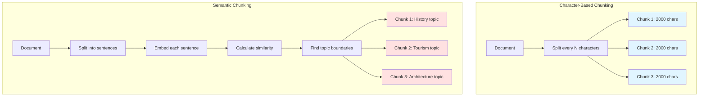

## Diagram 2: Semantic Chunking Process Flow

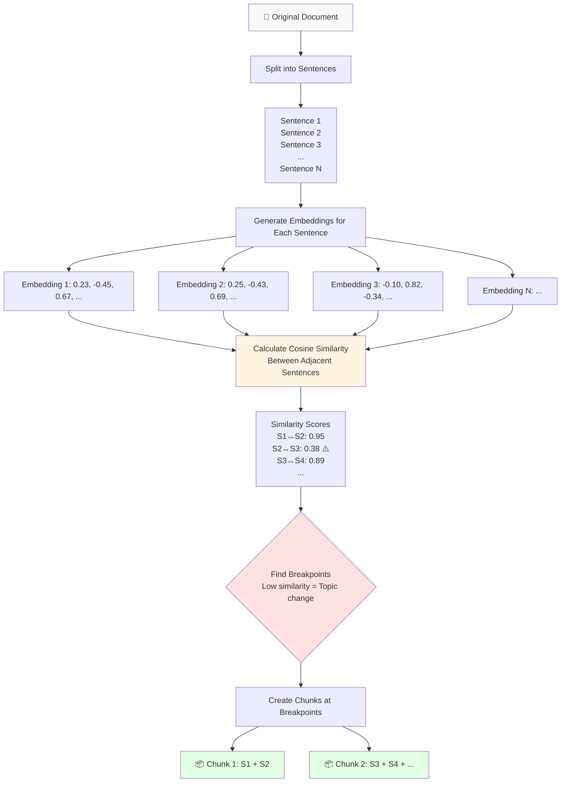

## Diagram 3: Similarity Detection Process

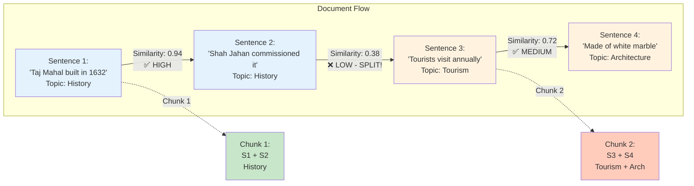

## Diagram 4: Step-by-Step Algorithm

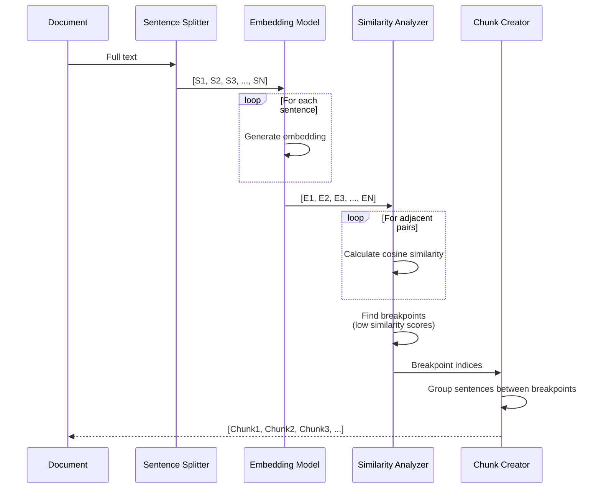

## Diagram 5: Cost Comparison

```mermaid
graph TB
    subgraph "Character Chunking Cost"
        D1[10,000 word document] --> S1[Split into ~20 chunks]
        S1 --> E1[Embed 20 chunks]
        E1 --> Cost1[💰 Cost: $0.02]
    end
    
    subgraph "Semantic Chunking Cost"
        D2[10,000 word document] --> S2[Split into ~500 sentences]
        S2 --> E2[Embed 500 sentences]
        E2 --> A2[Calculate 500 similarities]
        A2 --> E3[Embed 25 final chunks]
        E3 --> Cost2[💰 Cost: $0.40]
    end
    
    style Cost1 fill:#c8e6c9
    style Cost2 fill:#ffcdd2
```

## Diagram 6: When to Use Each Method

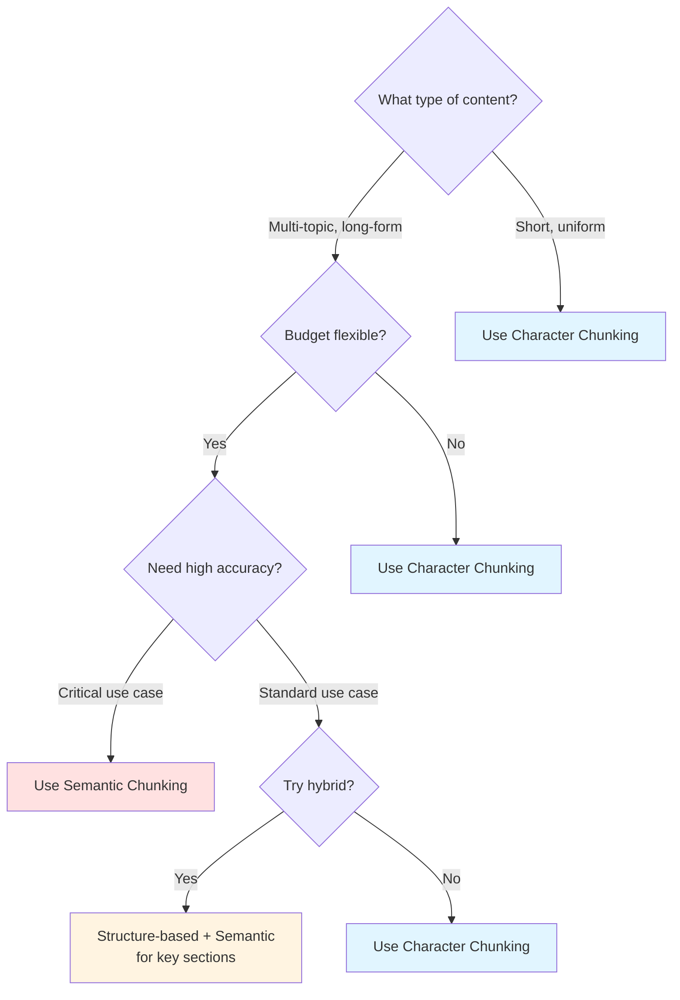

## Diagram 7: Breakpoint Detection Methods

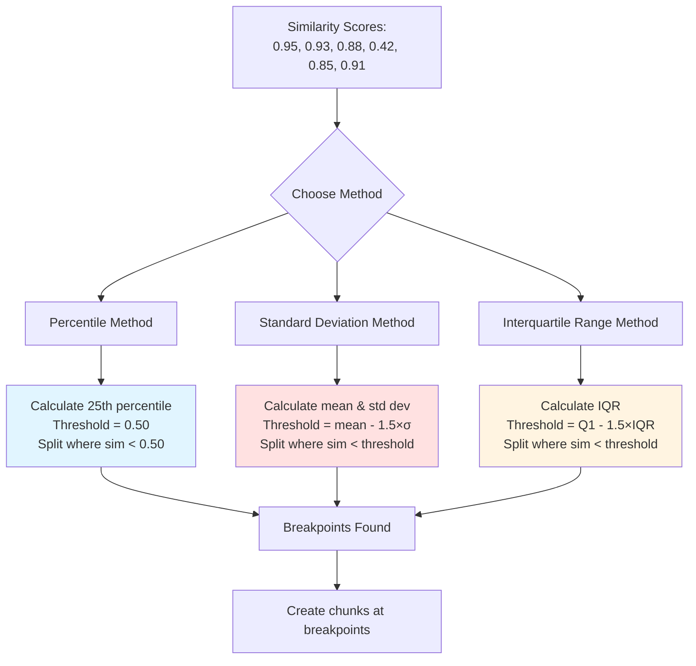

## Diagram 8: Real Example Walkthrough

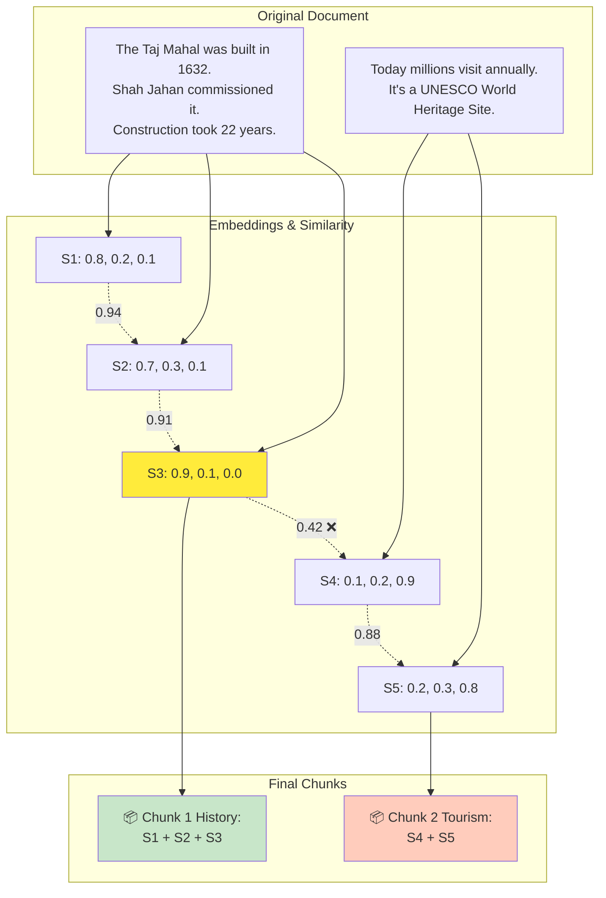

## Diagram 9: Threshold Calculation - Math Explained

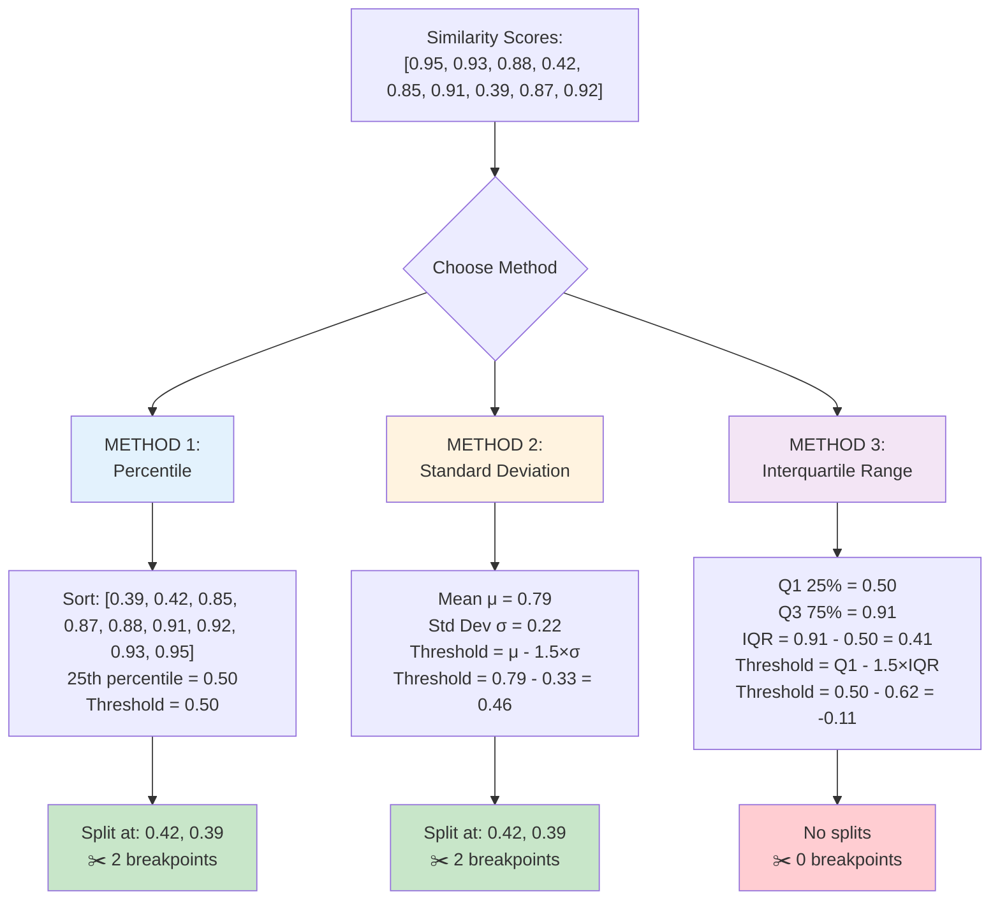

## Diagram 10: How to Choose Your Threshold Method

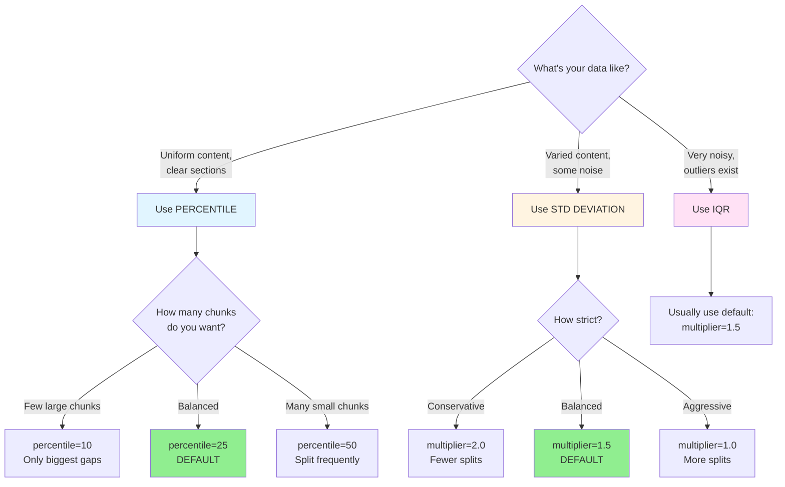

## Diagram 11: Real Example with All Three Methods

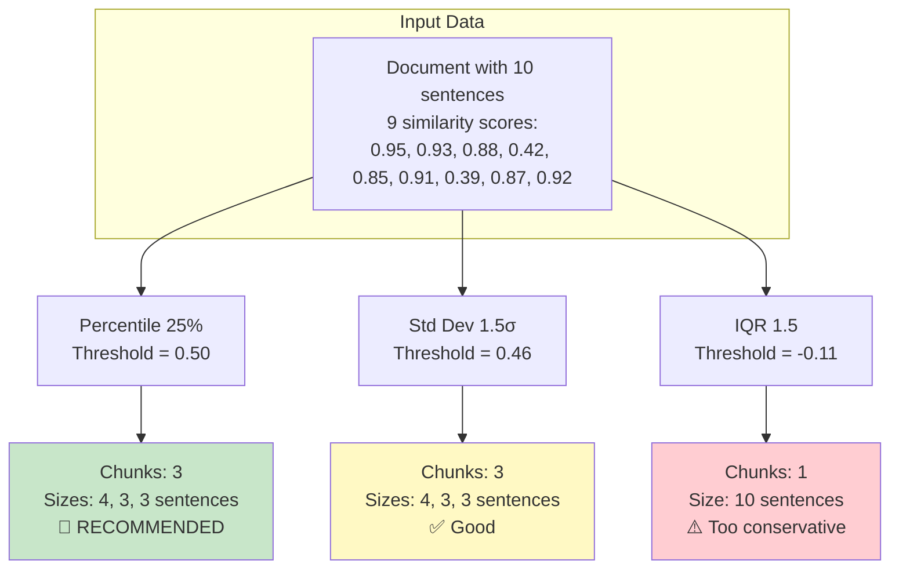

---

## Usage Tips for Teaching:

1. **Start with Diagram 1** - Show the conceptual difference
2. **Use Diagram 2** - Walk through the complete process
3. **Show Diagram 3** - Concrete example with actual sentences
4. **Explain with Diagram 7** - How breakpoints are found mathematically
5. **Compare with Diagram 5** - Cost reality check
6. **Conclude with Diagram 6** - When to actually use it

These diagrams can be rendered in:
- Markdown preview in VS Code
- Jupyter notebooks (with mermaid extension)
- Online tools like mermaid.live
- Documentation sites (GitHub, GitLab, etc.)
