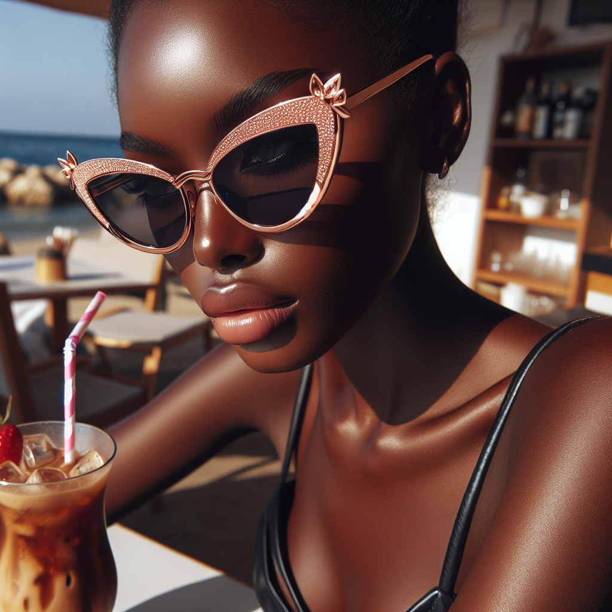

# 🕶️ Summer Sunglasses Campaign – Executive Summary

## 📊 Refined Trend Insights
### Executive Summary: Summer 2024 Sunglasses Trends and Product Recommendations

After a thorough market analysis, we present an insightful overview of the leading sunglasses trends for Summer 2024, complemented by curated product recommendations from our catalog. This summary aims to guide strategic decisions for our upcoming summer campaign.

#### Key Sunglasses Trends for Summer 2024

1. **Oversized & Statement Frames:**
   - **Overview:** Oversized sunglasses remain a dominant trend, combining style with enhanced sun protection. Popular silhouettes include oversized cat-eye and aviator styles.
   - **Color Palette:** Expect to see bold hues, particularly in metallic finishes like rose gold, which capture attention effortlessly.

2. **Retro Revival:**
   - **Overview:** Vintage-inspired designs, such as round and tortoiseshell frames, are making a significant comeback, appealing to a broad demographic through a sense of nostalgia.
   - **Distinctive Features:** These frames often showcase unique patterns and shapes, enhancing their classic appeal.

3. **Geometric Shapes:**
   - **Overview:** Geometric sunglasses are increasingly fashionable, with sharp, angular designs that introduce a modern flair to any attire.
   - **Color & Finish Trends:** Mirrored lenses and metallic shades amplify the striking look of these frames.

#### Curated Product Recommendations

1. **Oversized Glam Rose Gold (SG006)**
   - **Style:** Oversized
   - **Description:** Luxurious oversized sunglasses featuring eye-catching rose gold detailing.
   - **Price:** $159.99
   - **Alignment with Trend:** Captures the essence of oversized and statement frames, positioning it as a stylish option for summer consumers.

2. **Round Vintage Tortoise (SG002)**
   - **Style:** Round
   - **Description:** Nostalgic round sunglasses crafted with a tortoiseshell frame.
   - **Price:** $129.99
   - **Alignment with Trend:** Embodies the retro style trend, appealing to those seeking a fashionable nod to the past.

3. **Geometric Modern Silver (SG008)**
   - **Style:** Geometric
   - **Description:** Chic geometric frames equipped with mirrored lenses.
   - **Price:** $144.99
   - **Alignment with Trend:** Perfectly aligns with the growing interest in geometric shapes, targeting trend-conscious consumers.

### Conclusion

By emphasizing oversized frames, retro designs, and geometric styles in our Summer 2024 sunglasses campaign, we can effectively engage our target audience. The featured products are tailored to these trends, ensuring a diverse portfolio that resonates with consumer preferences. Your leadership will be pivotal as we leverage these insights to position our brand prominently in the market.

## 🎯 Campaign Visual

## ✍️ Campaign Quote
> Bold Elegance: Shine in Summer's Statement Shades.

## ✅ Why This Works
The quote highlights the oversized, rose gold sunglasses in the image, aligning with the trend of statement frames and bold colors for summer 2024.

---

*Report generated on 2026-04-01 at 17:00:25*
